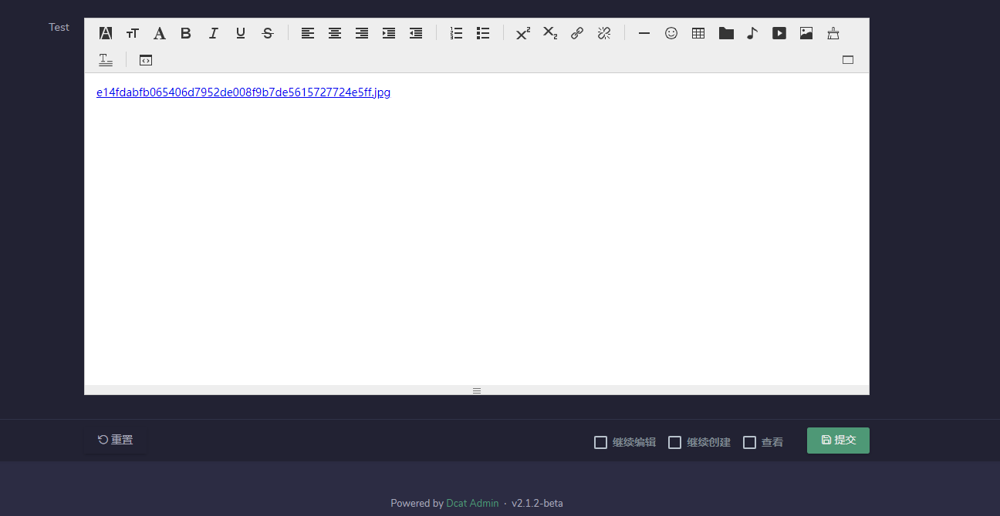

# Dcat Admin Form Extend

---

* [iceEditor](https://www.iceui.cn/iceEditor/)
* [Dcat-Admin](https://github.com/jqhph/dcat-admin)

---

# 安装
## composer

---
```shell
composer require death_satan/dcat-ice-editor -vvv
```
---
## 截图示例

---



---

# 使用
## Form

```php
$form =\Dcat\Admin\Form::make();
$form->iceEditor('field')
    ->disk('local') //设置驱动
    ->load(<<<JAVASCRIPT
    //修改图片或附件上传提交表单的路径
    this.uploadUrl="/iceEditor/src/upload.php";
JAVASCRIPT
          )
    ->path('upload/files/');//设置上传路径
```

